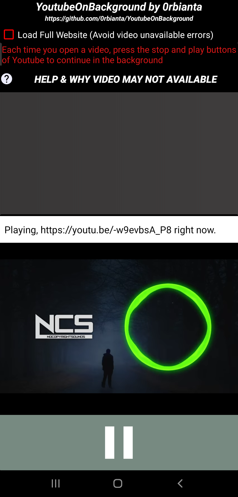

# YouTubeOnBackground
Open source software written for Android that lets you play Youtube videos in the background.

You can access a lot of music and videos on YouTube, but you can't play them in the background. It's okay because this open-source, development-oriented software can only link and run playlists, live feeds and videos on YouTube.

<H1>Attention! This application is subject to certain copyrights.</H1>
<h3>Please pay attention to copyright as a conscious and honorable developer.</h3>
<H2>Copyright 2020 0rbianta</H2>
